## `~/projects`

<table>
<tr><td>
 
<samp>PHISHING ANALYSIS</samp>
<h3><a href="https://github.com/edda1011/CyberFish"><code>./CyberFish</code></a></h3>

<samp>Inspect suspicious links, emails, and QR codes with clear evidence and practical next steps.</samp>

  

<samp><a href="https://github.com/edda1011/CyberFish">source ↗</a> &nbsp; / &nbsp; <a href="https://cyber-fish-pi.vercel.app">live demo ↗</a></samp>

</td></tr>
<tr><td>
 
<samp>WINDOWS SECURITY</samp>
<h3><a href="https://github.com/edda1011/ThreatLens"><code>./ThreatLens</code></a></h3>

<samp>A local-first project for turning Windows security events into understandable alerts.</samp>

Pre-alpha · CLI foundation ready; monitoring and detection are not implemented yet.

  

<samp><a href="https://github.com/edda1011/ThreatLens">source ↗</a></samp>

</td></tr>
<tr><td>
 
<samp>AI &amp; ON-CHAIN VERIFICATION</samp>
<h3><a href="https://github.com/edda1011/FortiFi"><code>./FortiFi</code></a></h3>

<samp>Multi-model financial claim verification, ETH risk analysis, and tamper-evident records on Sui.</samp>

   

<samp><a href="https://github.com/edda1011/FortiFi">source ↗</a></samp>

</td></tr>
</table>

## `~/contact`

<samp><a href="mailto:menghuo1011@gmail.com">email ↗</a> &nbsp; / &nbsp; <a href="https://www.linkedin.com/in/edda-chok-596171369/">linkedin ↗</a></samp>
